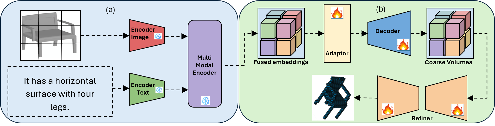

# Pix2Vox++

This repository contains the source code for the paper [Enhancing Single-View 3D Reconstruction with Semantic Insights from Large Language Models]. 

[](https://lgtm.com/projects/g/hzxie/Pix2Vox/context:python)
[](https://lgtm.com/projects/g/hzxie/Pix2Vox/alerts/)



<!-- ## Cite this work

```
``` -->

## Datasets

We use the [ShapeNet](https://www.shapenet.org/), [Pix3D](http://pix3d.csail.mit.edu/), and Things3D datasets in our experiments, which are available below:

- ShapeNet rendering images: http://cvgl.stanford.edu/data2/ShapeNetRendering.tgz
- ShapeNet voxelized models: http://cvgl.stanford.edu/data2/ShapeNetVox32.tgz
- Pix3D images & voxelized models: http://pix3d.csail.mit.edu/data/pix3d.zip
- Things3D:[https://gateway.infinitescript.com/?fileName=Things3D](https://gateway.infinitescript.com/?fileName=Things3D)

## Pretrained Models
<!-- 
The pretrained models on ShapeNet are available as follows:

- [Pix2Vox++/A](https://gateway.infinitescript.com/?fileName=Pix2Vox%2B%2B-A-ShapeNet.pth) (385.4 MB)
- [Pix2Vox++/F](https://gateway.infinitescript.com/?fileName=Pix2Vox%2B%2B-F-ShapeNet.pth) (19.4 MB) -->

## Prerequisites

#### Clone the Code Repository

```
git clone https://github.com/Siyavashshabani/VL2Vox.git
```

#### Install Python Denpendencies

```
cd VL2Vox
pip install -r requirements.txt
```

#### Update Settings in `config.py`

You need to update the file path of the datasets:

```
__C.DATASETS.SHAPENET.RENDERING_PATH        = '/path/to/Datasets/ShapeNet/ShapeNetRendering/%s/%s/rendering/%02d.png'
__C.DATASETS.SHAPENET.VOXEL_PATH            = '/path/to/Datasets/ShapeNet/ShapeNetVox32/%s/%s/model.binvox'
__C.DATASETS.PASCAL3D.ANNOTATION_PATH       = '/path/to/Datasets/PASCAL3D/Annotations/%s_imagenet/%s.mat'
__C.DATASETS.PASCAL3D.RENDERING_PATH        = '/path/to/Datasets/PASCAL3D/Images/%s_imagenet/%s.JPEG'
__C.DATASETS.PASCAL3D.VOXEL_PATH            = '/path/to/Datasets/PASCAL3D/CAD/%s/%02d.binvox'
__C.DATASETS.PIX3D.ANNOTATION_PATH          = '/path/to/Datasets/Pix3D/pix3d.json'
__C.DATASETS.PIX3D.RENDERING_PATH           = '/path/to/Datasets/Pix3D/img/%s/%s.%s'
__C.DATASETS.PIX3D.VOXEL_PATH               = '/path/to/Datasets/Pix3D/model/%s/%s/%s.binvox'
__C.DATASETS.THINGS3D                       = edict()
__C.DATASETS.THINGS3D.TAXONOMY_FILE_PATH    = './datasets/Things3D.json'
__C.DATASETS.THINGS3D.RENDERING_PATH        = '/path/to/Datasets/Things3D/%s/%s/%s/render_%02d_final.png'
__C.DATASETS.THINGS3D.VOXEL_PATH            = '/path/to/Datasets/ShapeNet/ShapeNetVox32/%s/%s.binvox'
```

## Get Started

To train VL2Vox, you can simply use the following command:

```
python3 train.py  --weights=./pre_train/Pix2Vox++-A-ShapeNet.pth

```

To test VL2Vox, you can use the following command:

```
python3 test.py --test --weights ./output/checkpoints/.../checkpoint-best.pth

```


## How to check the tensorboard during:

```
tensorboard --logdir=output/logs/2024-12-14T14:16:59.167735
```


## License

This project is open sourced under MIT license.
